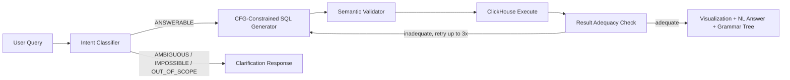

# Architecture

## 1. Purpose and Scope

Parsec is a natural-language query interface for a GitHub events dataset in ClickHouse.
Users ask plain-English questions; the system returns:

- a safe SQL query
- structured results (table/chart/scalar/empty)
- a concise natural-language answer
- clarification guidance when a question is ambiguous or impossible

Core scope is intentionally narrow:

- single-table analytics on `github_events`
- read-only SQL (`SELECT` only)
- no joins, no subqueries, no write operations

## 2. High-Level System Flow



Primary implementation entrypoint: [`app/api/query/route.ts`](../app/api/query/route.ts)

## 3. Safety Model

Safety is layered:

1. CFG-constrained decoding (hard boundary)
   - model output must match grammar, so unsupported SQL cannot be emitted
   - GPT-5 with CFG specification (see [OpenAI docs](https://developers.openai.com/cookbook/examples/gpt-5/gpt-5_new_params_and_tools#3-contextfree-grammar-cfg))
2. Semantic validation (soft checks)
   - checks for `GROUP BY` consistency, missing `LIMIT` warnings, date-range sanity, identifier sanity
3. Runtime guardrails (DB client settings)
   - execution/time/result size caps in ClickHouse client settings

Blocked by grammar design:

- DDL/DML (`DROP`, `ALTER`, `INSERT`, `UPDATE`, `DELETE`)
- joins and subqueries
- system table access
- `SELECT *`
- multi-statement chaining

Key files:

- [`lib/sql/generator.ts`](../lib/sql/generator.ts)
- [`lib/cfg/grammar-template.ts`](../lib/cfg/grammar-template.ts)
- [`lib/cfg/grammar-builder.ts`](../lib/cfg/grammar-builder.ts)
- [`lib/sql/validator.ts`](../lib/sql/validator.ts)
- [`lib/clickhouse/client.ts`](../lib/clickhouse/client.ts)

## 4. Data Model and Runtime

Main table: `github_events` with 10 columns and enum event types.

Current event types include:

- `PushEvent`, `WatchEvent`, `IssuesEvent`, `PullRequestEvent`
- `PullRequestReviewCommentEvent`, `PullRequestReviewEvent`
- and related GitHub activity event types

Runtime topology:

- local dev: Docker ClickHouse
- deployed demo: Tinybird

Related files:

- [`scripts/init.sql`](../scripts/init.sql)
- [`docker-compose.yml`](../docker-compose.yml)
- [`lib/clickhouse/schema.ts`](../lib/clickhouse/schema.ts)
- [`lib/clickhouse/client.ts`](../lib/clickhouse/client.ts)

## 5. API Surface

### `POST /api/query`

Request:

```json
{ "query": "top 10 repos by push events" }
```

Response status families:

- `success`
  - includes: `answer`, `sql`, `result`, `visualizationHint`, `grammarDerivation`, `intentClassification`
- `clarification_needed`
- `impossible`
- `out_of_scope`
- `error`

### `POST /api/evals/run`

Runs eval categories:

- `grammar-coverage`
- `grammar-safety`
- `semantic`
- `degradation`
- `adequacy`

Returns:

- aggregate summary by category
- per-case results

API files:

- [`app/api/query/route.ts`](../app/api/query/route.ts)
- [`app/api/evals/run/route.ts`](../app/api/evals/run/route.ts)
- [`lib/types/index.ts`](../lib/types/index.ts)

## 6. Evaluation Model

The project evaluates both language constraints and model behavior.

| Category | Level | Metric | What it proves |
|---|---|---|---|
| Grammar Coverage | Grammar | Recall | Supported query patterns are expressible |
| Grammar Safety | Grammar | Precision | Dangerous SQL is rejected by grammar |
| Semantic | Model | Accuracy | NL -> SQL -> execution correctness |
| Degradation | Model | Accuracy | Correct handling of ambiguous/impossible/out-of-scope queries |
| Adequacy | Model | Accuracy | Result-quality checker catches non-answering outputs |

Key files:

- [`lib/evals/runner.ts`](../lib/evals/runner.ts)
- [`lib/evals/metrics.ts`](../lib/evals/metrics.ts)
- [`lib/evals/cases/*`](../lib/evals/cases/)
- [`scripts/run-evals.ts`](../scripts/run-evals.ts)

## 7. Operational Essentials

Required environment variables:

- `OPENAI_API_KEY`
- `CLICKHOUSE_URL`

Useful commands:

```bash
# app
npm run dev

# run all evals
npm run evals

# run one category
npm run evals -- --category grammar-safety
```

Data ingest helpers:

- [`scripts/seed-data.sh`](../scripts/seed-data.sh)
- [`scripts/ingest.sh`](../scripts/ingest.sh)
